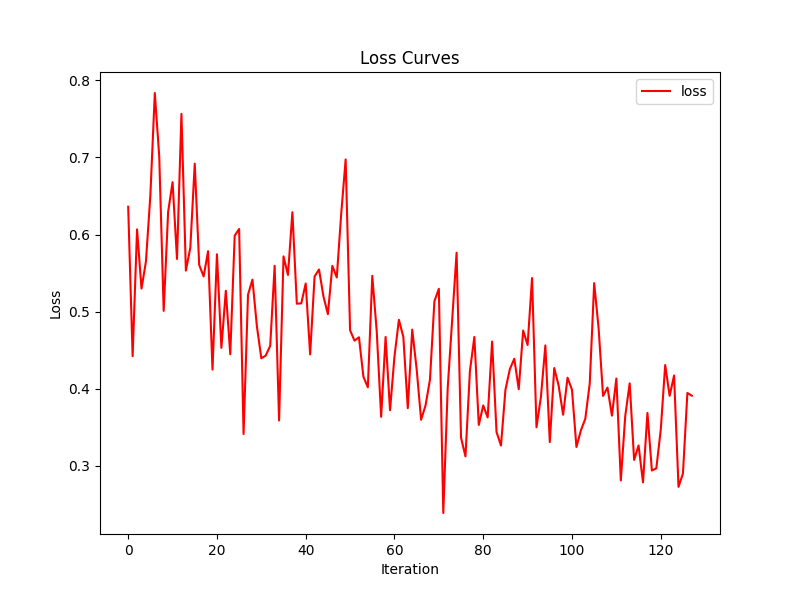

# Demo
## 1. 模型概述
Demo是PyTorch官方提供的ddp教程中的例子，来自于https://github.com/pytorch/examples/tree/main/distributed/ddp-tutorial-series。
> 在这里给出你所适配的模型的介绍。例如来自哪个领域，做什么的，paper链接，原始仓库链接等。

## 2. 快速开始
使用本模型执行训练的主要流程如下：
1. 基础环境安装：介绍训练前需要完成的基础环境检查和安装。
2. 获取数据集：介绍如何获取训练所需的数据集。
3. 构建环境：介绍如何构建模型运行所需要的环境
4. 启动训练：介绍如何运行训练。

### 2.1 基础环境安装

请参考[基础环境安装](../../../../doc/Environment.md)章节，完成训练前的基础环境检查和安装。
> 当前提供给生态用户的环境已经包含所有的基础软件，这里复制此段命令即可

### 2.2 准备数据集
#### 2.2.1 获取数据集
> 此处demo使用的是dummy数据集，无需下载数据集。

> 如果使用开源数据集或权重，提供开源获取方式和数据处理方法。如果使用非开源数据集或权重，请提供百度网盘下载链接和数据处理方法。

#### 2.2.2 处理数据集
> 一般下载好的数据集，是不能直接使用的，需要进行解压，处理等操作。请在这里给出详细的步骤。


### 2.3 构建环境

所使用的环境下已经包含PyTorch框架虚拟环境
1. 执行以下命令，启动虚拟环境。
    ```
    conda activate torch_env
    ```

>  当前提供给生态用户的环境已经包含paddle和torch框架，启动即可以使用。
2. 安装python依赖
    ```
    pip install -r requirements.txt
    ```
> 请不要再requirements.txt中添加paddle和torch，添加其他x86上的依赖即可。
### 2.4 启动训练
1. 在构建好的环境中，进入训练脚本所在目录。
    ```
    cd <ModelZoo_path>/PyTorch/contrib/Classification/Demo/run_scripts
    ```

2. 运行训练。该模型支持单机单卡.

    -  单机单卡
    ```
   python run_demo.py --nproc_per_node 4 --model_name demo --epoch 2 --batch_size 32 --device sdaa
    ```

    更多训练参数参考[README](run_scripts/README.md)

### 2.5 训练结果
训练loss曲线: 


最小 loss: 0.2390090525150299
最终 loss: 0.39109787344932556

> 如果为完整的训练或微调任务，请提供最终的metric结果。
> 如果为短训，请提供loss曲线图和最终的loss结果。