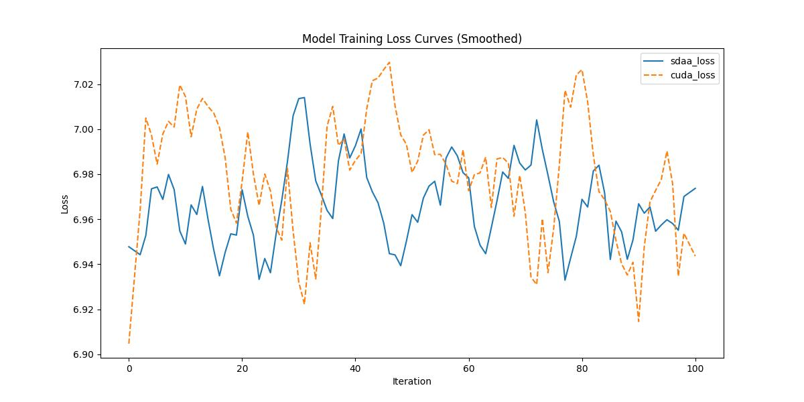

# Swin_Transformer
## 1. 模型概述
Swin Transformer（Shifted Window Transformer）是由微软亚洲研究院（MSRA）在 2021年提出的一种层次化视觉Transformer，旨在解决标准 Vision Transformer（ViT）在高分辨率图像处理和计算效率上的局限性。Swin Transformer通过局部窗口计算和层级特征融合，在 图像分类、目标检测、语义分割等任务上取得了SOTA性能。

- 论文链接：[[2103.14030]]]Swin Transformer: Hierarchical Vision Transformer using Shifted Windows(https://arxiv.org/abs/2103.14030)
- 仓库链接：https://github.com/open-mmlab/mmpretrain/tree/main/configs/swin_transformer

## 2. 快速开始
使用本模型执行训练的主要流程如下：
1. 基础环境安装：介绍训练前需要完成的基础环境检查和安装。
2. 获取数据集：介绍如何获取训练所需的数据集。
3. 构建环境：介绍如何构建模型运行所需要的环境。
4. 启动训练：介绍如何运行训练。

### 2.1 基础环境安装

请参考基础环境安装章节，完成训练前的基础环境检查和安装。

### 2.2 准备数据集
#### 2.2.1 获取数据集
Deit 使用 ImageNet 数据集，该数据集为开源数据集，可从 [ImageNet](https://image-net.org/) 下载。

#### 2.2.2 处理数据集
具体配置方式可参考：https://blog.csdn.net/xzxg001/article/details/142465729。


### 2.3 构建环境

所使用的环境下已经包含PyTorch框架虚拟环境。
1. 执行以下命令，启动虚拟环境。
    ```
    conda activate torch_env
    ```
2. 安装python依赖。
    ```
    git clone https://gitee.com/xiwei777/mmengine_sdaa.git 
    cd mmengine_sdaa 
    pip3 install -r requirements.txt 
    pip3 install opencv_python mmcv --no-deps
    python setup.py install 
    cd .. 
    git clone http://10.10.30.109/tecoap1/application/mmpretrain.git 
    pip install -r requirements.txt
    pip install -e .
    ```

### 2.4 启动训练

1. 在构建好的环境中，进入训练脚本所在目录。
    ```
    cd <ModelZoo_path>/PyTorch/contrib/Classification/Swin -Transformer/run_scripts
    ```

2. 运行训练。该模型支持单机单卡。
    ```
   torchrun --master_port=29500 ./run_swin_transformer.py ./swin_transformer/swin-tiny_16xb64_in1k.py --launcher pytorch --amp | tee sdaa.log
   ```
    更多训练参数参考 run_scripts/argument.py

### 2.5 训练结果
输出训练loss曲线及结果（参考使用[loss.py](./run_scripts/loss.py)）: 



MeanRelativeError: -0.0017039327120047533
MeanAbsoluteError: -0.01243681010633412
Rule,mean_absolute_error -0.01243681010633412
pass mean_relative_error=-0.0017039327120047533 <= 0.05 or mean_absolute_error=-0.01243681010633412 <= 0.0002