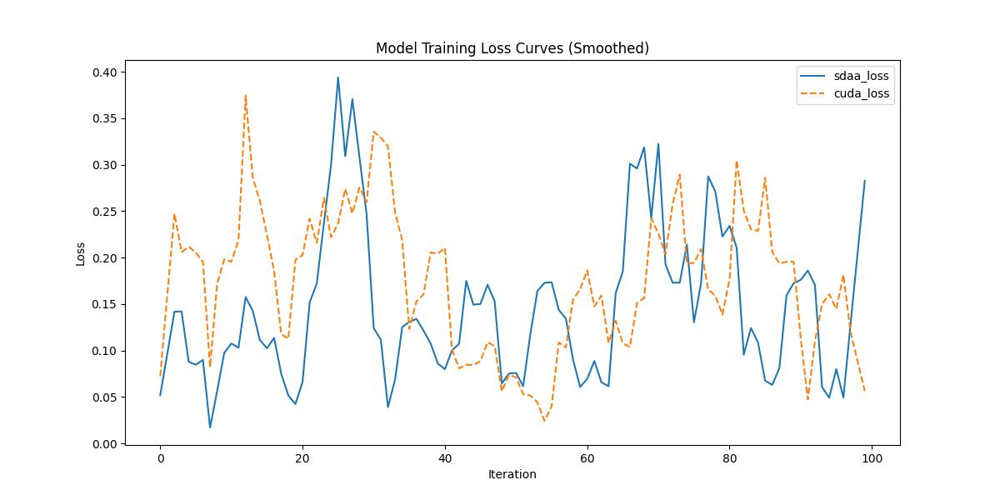

#stable-diffusion-v1-5
## 1. 模型概述
本项目基于 Stable Diffusion v1.5 文本生成图像模型进行训练微调，并使用 SDAA 加速框架提升训练性能。该模型核心由以下组件构成：UNet2DConditionModel：图像生成主干网络；CLIPTextModel：文本编码器；AutoencoderKL：VAE 图像解码器；DDPMScheduler：扩散过程调度器。
训练任务使用 COCO Captions 2017 数据集，通过文本条件对 UNet 进行训练微调。

- 模型链接：[[model]](https://www.modelscope.cn/models/songkey/stable-diffusion-v1-5/summary) 

## 2. 快速开始
使用本模型执行训练的主要流程如下：
1. 基础环境安装：介绍训练前需要完成的基础环境检查和安装。
2. 获取数据集：介绍如何获取训练所需的数据集。
3. 构建环境：介绍如何构建模型运行所需要的环境。
4. 启动训练：介绍如何运行训练。

### 2.1 基础环境安装
请参考基础环境安装章节，完成训练前的基础环境检查和安装。

### 2.2 准备数据集
stable-diffusion-v1-5使用 COCO数据集，该数据集为开源数据集，可从 [COCO](http://images.cocodataset.org) 下载。

### 2.3项目下载
1.SDK下载
```
#安装ModelScope
pip install modelscope
#SDK模型下载
from modelscope import snapshot_download
model_dir = snapshot_download('songkey/stable-diffusion-v1-5')
```
2.或者Git下载
```
#Git模型下载
git clone https://www.modelscope.cn/songkey/stable-diffusion-v1-5.git
```
一定要下载完整的权重文件，否则会报错。github下载的模型缺少部分权重文件，导致训练报错。
| 模块            | 目录              | 文件类型                    | 是否训练中更新   |
| ------------- | --------------- | ----------------------- | --------- |
| tokenizer     | `tokenizer/`    | vocab/merges            | ❌         |
| text\_encoder | `text_encoder/` | `.bin + config.json`    | ❌         |
| vae           | `vae/`          | `.bin + config.json`    | ❌         |
| unet          | `unet/`         | `.bin + config.json`    | ✅ 训练更新后保存 |
| scheduler     | `scheduler/`    | `scheduler_config.json` | ❌         |

### 2.4 构建环境
所使用的环境下已经包含PyTorch框架虚拟环境。
1. 执行以下命令，启动虚拟环境。
    ```
    conda activate torch_env_py310
    ```
2. 安装python依赖。
    ```
    pip install -r requirements.txt
    ```

### 2.4 启动训练

1. 在构建好的环境中，进入训练脚本所在目录。
    ```
    cd ./stable-diffusion-v1-5/run_scripts
    ```

2. 运行训练。该模型支持单机单卡。
```
#必须指定 COCO 路径
python run_demo.py \
  --coco_img_root /path/to/COCO/train2017 \
  --coco_ann_path /path/to/COCO/annotations/captions_train2017.json \
  --max_iter 100 \
  --batch_size 1
```
### 2.5 训练结果
输出训练loss曲线及结果（参考使用[loss.py](./run_scripts/loss.py)）: 

MeanRelativeError: 3.8737747726536327
MeanAbsoluteError: -0.03044878999999999
Rule,mean_absolute_error -0.03044878999999999
pass mean_relative_error=3.8737747726536327 <= 0.05 or mean_absolute_error=-0.03044878999999999 <= 0.0002

