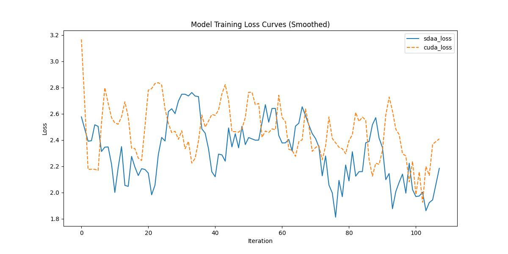

# Segformer
## 1. 模型概述
SegFormer是一个简单高效却强大的语义分割框架，它将Transformer架构与轻量级多层感知器（MLP）解码器相融合。SegFormer具备两大核心优势：1）采用新颖的层次化Transformer编码器输出多尺度特征，无需位置编码设计，从而避免了因测试分辨率与训练不一致导致的位置编码插值性能下降问题；2）摒弃复杂解码器结构，所提出的MLP解码器通过聚合不同层级的特征，巧妙融合局部注意力与全局注意力以生成强表征力特征。研究表明，这种简洁轻量的设计是实现Transformer高效分割的关键。我们通过模型缩放得到SegFormer-B0至SegFormer-B5系列模型，在性能和效率上均显著超越同类方案。例如，SegFormer-B4在ADE20K数据集上以仅6400万参数取得50.3% mIoU，参数量减少5倍的同时精度提升2.2%。旗舰模型SegFormer-B5在Cityscapes验证集达到84.0% mIoU，并在Cityscapes-C上展现出卓越的零样本鲁棒性。
- 论文链接：[SegFormer: Simple and Efficient Design for Semantic Segmentation with Transformers](https://arxiv.org/abs/2105.15203)
- 仓库链接：[https://github.com/open-mmlab/mmsegmentation/tree/main/configs/segformer](https://github.com/open-mmlab/mmsegmentation/tree/main/configs/segformer)

1.基础环境安装：介绍训练前需要完成的基础环境检查和安装。

2.获取数据集：介绍如何获取训练所需的数据集。

3.构建环境：介绍如何构建模型运行所需要的环境。

4.启动训练：介绍如何运行训练。

## 2.1 基础环境安装
请参考基础环境安装章节，完成训练前的基础环境检查和安装。
## 2.2 准备数据集
Segformer使用Cityscapes数据集，该数据集为开源数据集，可从[CityScapes](https://www.cityscapes-dataset.com/login/)下载。
## 2.3 构建环境
所使用的环境下已经包含PyTorch框架虚拟环境。
1. 执行以下命令，启动虚拟环境。 
   ```
   conda activate torch_env
   ```
2. 安装python依赖。
   ```
   pip3 install  -U openmim 
   pip3 install git+https://gitee.com/xiwei777/mmengine_sdaa.git 
   pip3 install opencv_python mmcv --no-deps
   mim install -e .
   pip install -r requirements.txt
   ```
## 2.4 启动训练

1.在构建好的环境中，进入训练脚本所在目录。
   ```
   cd <ModelZoo_path>/PyTorch/contrib/Segmentation/SEGFormer/run_scripts
   ``` 
2. 运行训练。该模型支持单机单卡。
   ```
   python run_segformer.py --config ../configs/segformer/segformer_mit-b0_8xb1-160k_cityscapes-1024x1024.py  \
    --launcher pytorch --nproc-per-node 1 --amp 2>&1 | tee sdaa.log
   ```
更多训练参数参考 run_scripts/argument.py

## 2.5 训练结果
输出训练loss曲线及结果:
   


MeanRelativeError:-0.01389159992542653

MeanAbsoluteError:-0.16568417549133302

Rule,mean absolute error -0.16568417549133302

pass mean relative error=-0.01389159992542653 <= 0.05 or mean absolute error=-0.16568417549133302 <= 0.0002