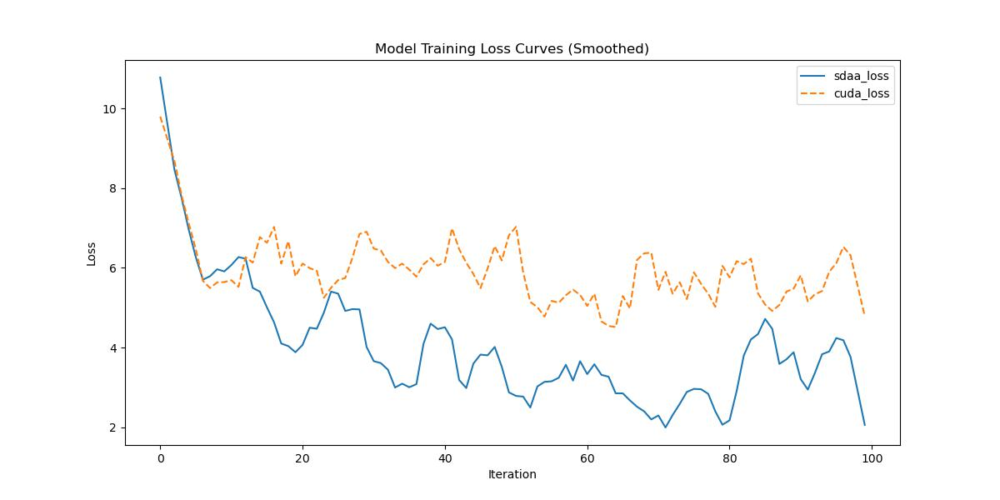

# EncNet
## 1. Model Overview
In this paper, we address the scene segmentation task by capturing rich contextual dependencies based on the selfattention mechanism. Unlike previous works that capture contexts by multi-scale features fusion, we propose a Dual Attention Networks (DANet) to adaptively integrate local features with their global dependencies. Specifically, we append two types of attention modules on top of traditional dilated FCN, which model the semantic interdependencies in spatial and channel dimensions respectively. The position attention module selectively aggregates the features at each position by a weighted sum of the features at all positions. Similar features would be related to each other regardless of their distances. Meanwhile, the channel attention module selectively emphasizes interdependent channel maps by integrating associated features among all channel maps. We sum the outputs of the two attention modules to further improve feature representation which contributes to more precise segmentation results. We achieve new state-of-the-art segmentation performance on three challenging scene segmentation datasets, i.e., Cityscapes, PASCAL Context and COCO Stuff dataset. In particular, a Mean IoU score of 81.5% on Cityscapes test set is achieved without using coarse data. 
- Paper Link: [Dual Attention Network for Scene Segmentation](https://arxiv.org/abs/1809.02983)
- Code Link: [Code](https://github.com/junfu1115/DANet/)
## 2. Quick Start
The main steps for training with this model are as follows:
1. In the configured environment, navigate to the training script directory.
   ```
   cd <ModelZoo_path>/PyTorch/contrib/Segmentation/danet/run_scripts
   ```
2. Run the training script.
  ```
   python run_encnet.py --config ../configs/danet/danet_r50-d8_4xb2-80k_cityscapes-512x1024.py \
    --launcher pytorch --nproc-per-node 1 --amp 2>&1 | tee sdaa.log
   ```



MeanRelativeError: -0.38333116476042733

MeanAbsoluteError: -2.325974152088165

Rule,mean_absolute_error -2.325974152088165

pass mean_relative_error=-0.38333116476042733 <= 0.05 or mean_absolute_error=-2.325974152088165 <= 0.0002
