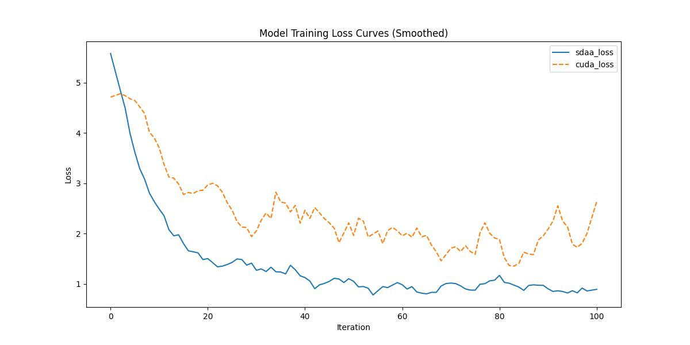

# EncNet
## 1. 模型概述
语义分割是自动驾驶车辆理解周围环境的核心技术。当前先进模型的高性能往往依赖于高计算量和长推理时间，这在实际自动驾驶场景中难以接受。现有方法通过轻量级架构（编码器-解码器或双通路结构）或低分辨率图像推理，实现了超快的场景解析速度——在单块1080Ti GPU上甚至能超过100 FPS。然而，这些实时方法与基于空洞卷积主干网络的模型仍存在显著性能差距。为此，我们提出专为实时语义分割设计的高效主干网络家族：深度双分辨率网络（DDRNets），其核心结构包含两条深度分支，通过多级双向融合机制交互特征。此外，我们设计了新型上下文信息提取器"深度聚合金字塔池化模块"（DAPPM），基于低分辨率特征图扩大有效感受野并融合多尺度上下文信息。本方法在Cityscapes和CamVid数据集上实现了精度与速度的最佳平衡：在单块2080Ti GPU上，DDRNet-23-slim模型在Cityscapes测试集达到77.4% mIoU/102 FPS，在CamVid测试集达到74.7% mIoU/230 FPS。经广泛使用的测试增强后，本方法在计算量大幅减少的情况下仍优于多数最先进模型。
- 论文链接：[Deep Dual-resolution Networks for Real-time and Accurate Semantic Segmentation of Road Scenes](http://arxiv.org/abs/2101.06085)
- 仓库链接：[Code](https://github.com/ydhongHIT/DDRNet)
## 2. 快速开始
使用本模型执行训练的主要流程如下：
1. 在构建好的环境中，进入训练脚本所在目录。
   ```
   cd <ModelZoo_path>/PyTorch/contrib/Segmentation/ddrnet_cityscapes/run_scripts
   ```
2. 运行训练。该模型支持单机单卡。
   ```
   python run_ddrnet.py --config ../configs/ddrnet/ddrnet_23-slim_in1k-pre_2xb6-120k_cityscapes-1024x1024.py \
    --launcher pytorch --nproc-per-node 1 --amp 2>&1 | tee sdaa.log
   ```
   


MeanRelativeError: -0.4552674768603906

MeanAbsoluteError: -0.9562658238410949

Rule,mean absolute error -0.9562658238410949

pass mean relative error=-0.4552674768603906 <= 0.05 or mean absolute error=-0.9562658238410949 <= 0.0002
